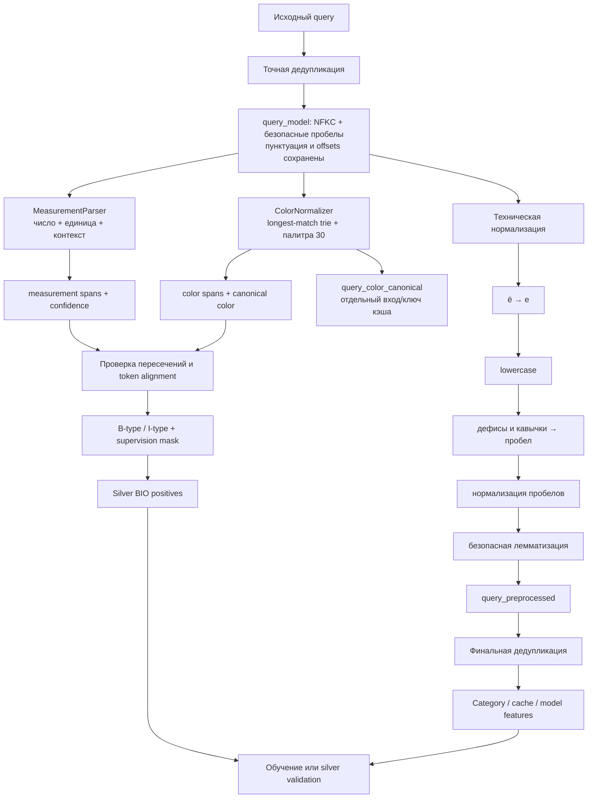

# Handoff: предобработка и BIO-разметка поисковых запросов

Актуальность: **22 июля 2026 года**. Версии контрактов:

- общая нормализация: `dictionary_consistent_v1`;
- цветовая палитра: `catalog_palette_30_v1`;
- measurement parser: `measurement_trie_v1`.

Этот документ отвечает на три практических вопроса:

1. Какие файлы являются актуальными и что нужно передать коллегам.
2. Как устроена предобработка без потери BIO offsets.
3. Какие данные допустимо использовать для обучения и проверки.

Минимальный online-набор и правила загрузки в GitHub вынесены в [`PRODUCTION_DEPLOYMENT.md`](PRODUCTION_DEPLOYMENT.md). Машиночитаемый список обязательных runtime-файлов находится в [`production_manifest.json`](production_manifest.json); его комплектность проверяет `verify_production_runtime.py`.

## Готовая единая точка входа

Весь runtime-процесс объединён в одном модуле [`unified_query_annotator.py`](unified_query_annotator.py). Публичная функция:

```python
from unified_query_annotator import annotate_query

result = annotate_query(
    "хочу купить телевизор Samsung темно-синий 55 дюймов 120 Гц со скидкой"
)
```

Результат содержит:

- все текстовые представления и очищенный от стоп-слов `query_search_text`;
- готовый `query_model_input`: lowercase/lemma, без разрешённых стоп-слов, с canonical-цветами;
- сохранённые intent-флаги удалённых условных слов;
- `facts` и `facts_by_type` для брендов, явных категорий, цветов и измерений;
- непересекающиеся `entities`, единые `bio_tags` и `bio_supervision_mask`;
- `rejected_candidates` с причиной каждого отклонения;
- версии словарей и parser-ов.

Ручная проверка:

```powershell
# Интерактивный цикл
.venv\Scripts\python.exe unified_query_annotator.py

# Один запрос
.venv\Scripts\python.exe unified_query_annotator.py `
  "купить телевизор Samsung черный 55 дюймов"

# Полный JSON и накопление результатов в одном JSONL
.venv\Scripts\python.exe unified_query_annotator.py --json `
  --output output/manual_annotations.jsonl `
  "монитор LG серый 27 дюймов 144 Гц"
```

## Короткий итог

- Полный корпус: **1 789 579** уникальных исходных запросов.
- После нормализации и дедупликации: **1 342 697** запросов.
- Measurement parser: **51 667** положительных BIO-сущностей в **43 395** запросах.
- Color normalizer: **109 515** сущностей в **104 508** запросах.
- Цветовые значения сведены к **30** классам; взвешенное покрытие каталога — **97,52%**.
- Silver validation: **201 405** запросов, то есть 15% нормализованного корпуса.
- Все character spans, BIO-теги и агрегаты проверены автоматическими verifier-скриптами.

## Главная схема



### Почему два текста

| Представление | Назначение | Можно брать offsets |
|---|---|---|
| `query_model` | основной текст для NER и token alignment | да |
| `query_preprocessed` | lowercase, леммы, дедупликация, category/cache features | нет, относительно исходной строки |
| `query_color_canonical` | дополнительный вход с оттенками, сведёнными к 30 цветам | нет |

Нельзя заменять `query_model` лемматизированным или canonical-текстом перед BIO: длины слов меняются, поэтому `start/end` перестают указывать на исходный span.

## Как формируется partial BIO

Пример запроса:

```text
монитор темно-синий 27" 144 Гц
```

| Токен | Предварительный тег | Mask | Источник |
|---|---|---:|---|
| монитор | `O` | false | не размечен автоматически |
| темно | `B-color` | true | ColorNormalizer |
| синий | `I-color` | true | ColorNormalizer |
| 27 | `B-screen_diagonal` | true | MeasurementParser |
| 144 | `B-refresh_rate` | true | MeasurementParser |
| Гц | `I-refresh_rate` | true | MeasurementParser |

`O + mask=false` означает «неизвестно», а не «сущности точно нет». При обучении loss считается только на `mask=true`. Иначе silver-разметка создаст большое количество ложных отрицательных примеров.

Знак `"` остаётся внутри character span `27"`, но не образует отдельный word token. Поэтому на word-level BIO тег `B-screen_diagonal` получает токен `27`.

Физические колонки audit-Parquet:

- measurement: `measurement_bio_entities_json`, `measurement_tokens_json`, `measurement_bio_tags_json`, `measurement_bio_mask_json`;
- colors: `color_bio_entities_json`, `color_tokens_json`, `color_bio_tags_json`, `color_bio_mask_json`;
- отдельный canonical-канал: `query_color_canonical`.

## Что загрузить в обычный Git

### 1. Обязательно: код и контракты

| Путь | Роль |
|---|---|
| `text_preprocessing/preprocess_queries.py` | главный preprocessing pipeline |
| `text_preprocessing/requirements.txt` | зафиксированные зависимости |
| `text_preprocessing/stopwords.ru.json` | текущий список стоп-слов |
| `search_dictionaries/color_palette.py` | определение 30 canonical-цветов |
| `search_dictionaries/color_normalizer.py` | production color trie и BIO |
| `search_dictionaries/measurement_parser.py` | production measurement parser и BIO |
| `search_dictionaries/units.py` | определения единиц измерения |
| `search_dictionaries/build_color_dictionary.py` | воспроизводимая сборка цветового словаря |
| `search_dictionaries/build_dictionaries.py` | сборка брендов, категорий и измерений |
| `search_dictionaries/audit_alias_coverage.py` | аудит alias-словарей на реальных вариантах запросов |
| `silver_annotation/build_silver_dataset.py` | сборка silver validation |
| `unified_query_annotator.py` | единая production-функция и ручной CLI |
| `test_unified_query_annotator.py` | end-to-end проверки единой разметки |
| `.gitattributes` | правила Git LFS для catalog Parquet |

Также нужно загрузить `__init__.py`, все `test_*.py`, `verify_*.py` и `README.md` в этих директориях.

### 2. Обязательно: небольшие runtime-артефакты

Эти файлы нужны clean clone без повторной сборки из исходного каталога:

| Путь | Размер | Зачем |
|---|---:|---|
| `search_dictionaries/output/color_palette.csv` | 1,8 КБ | стабильный список 30 классов |
| `search_dictionaries/output/color_aliases.csv` | 707 КБ | lookup оттенков RU/EN → canonical |
| `search_dictionaries/output/brands.json` | 1,1 МБ | защита совпадений цвета/единиц внутри брендов |
| `search_dictionaries/output/categories.json` | runtime | canonical-категории и поверхности поиска |
| `search_dictionaries/output/category_alias_overrides.json` | runtime | приоритетные синонимы и product family → общий класс |
| `search_dictionaries/output/alias_coverage_metrics.json` | audit | частоты и click-evidence алиасов на полном корпусе |
| `search_dictionaries/output/measurement_units.json` | 44 КБ | проверяемый экспорт единиц |
| `search_dictionaries/output/normalization_contract.json` | 1,4 КБ | порядок общей нормализации |
| `search_dictionaries/output/color_metrics.json` | 0,6 КБ | версия и покрытие палитры |
| `search_dictionaries/output/dictionary_metrics.json` | 2,3 КБ | версия и размеры словарей |

### 3. Рекомендуется: документация и аудиты

| Путь | Назначение |
|---|---|
| `PIPELINE_HANDOFF.md` | текущий handoff |
| `docs/pipeline_handoff.html` | автономный лендинг для команды |
| `search_dictionaries/COLOR_NORMALIZATION.md` | подробности палитры |
| `text_preprocessing/output/preprocessing_metrics.json` | итоговые показатели полного прогона |
| `text_preprocessing/output/text_preprocessing_report.html` | технический аудит preprocessing |
| `search_dictionaries/output/color_mapping_review.csv` | 611 значений для ручного решения |
| `silver_annotation/output/ANNOTATION_REPORT.md` | ограничения silver validation |
| `silver_annotation/output/annotation_metrics.json` | состав 15% validation |

## Что не следует добавлять в обычный Git

| Файл | Размер | Решение |
|---|---:|---|
| `query_clicks.parquet` | 651 МБ | объектное хранилище, DVC или Git LFS |
| `sku_desc.parquet` | 352 МБ | объектное хранилище, DVC или Git LFS |
| `skus.pkl` | 1,57 ГБ | предпочтительно объектное хранилище/DVC; LFS возможен с учётом квот |
| `pavel_nntp/data/processed/catalog_attributes.parquet` | 82 МБ | Git LFS уже указан в `.gitattributes` |
| `text_preprocessing/output/preprocessed_queries.parquet` | 81 МБ | воспроизводимый dataset artifact, не обычный Git |
| `text_preprocessing/output/preprocessed_queries_audit.parquet` | 146 МБ | Git LFS/artifact storage; обычный Git не примет |
| `silver_annotation/output/silver_labels.parquet` | 20,8 МБ | versioned dataset artifact или Git LFS |
| `search_dictionaries/output/dictionary.csv` | 26,4 МБ | генерируется; хранить в release/artifact storage при необходимости |
| `search_dictionaries/output/measurement_phrases.csv` | 20,7 МБ | генерируется; хранить в release/artifact storage при необходимости |

GitHub блокирует обычные Git-файлы больше 100 MiB; для больших файлов предназначен Git LFS. Лимит одного LFS-файла зависит от тарифа: 2 ГБ для Free/Pro, 4 ГБ для Team и 5 ГБ для Enterprise Cloud. Поэтому `skus.pkl` технически помещается в LFS Free, но объём хранилища и трафик делают DVC/S3/корпоративное хранилище более практичным вариантом. Источники: [GitHub — About large files](https://docs.github.com/en/repositories/working-with-files/managing-large-files/about-large-files-on-github), [GitHub — About Git LFS](https://docs.github.com/en/repositories/working-with-files/managing-large-files/about-git-large-file-storage).

> Важно: корневые `query_clicks.parquet`, `sku_desc.parquet` и `skus.pkl` сейчас не исключены корневым `.gitignore`. До `git add .` их нужно явно исключить или настроить LFS/DVC.

## Минимальный production bundle

Если коллегам нужен только inference preprocessing, достаточно передать:

```text
text_preprocessing/
  preprocess_queries.py
  requirements.txt
  stopwords.ru.json

search_dictionaries/
  __init__.py
  color_palette.py
  color_normalizer.py
  measurement_parser.py
  units.py
  output/
    color_palette.csv
    color_aliases.csv
    brands.json
    measurement_units.json
    normalization_contract.json
```

Для воспроизводимой сборки дополнительно нужны builder-скрипты и каталожные источники.

## Актуальные datasets

| Dataset | Строки | Статус |
|---|---:|---|
| `preprocessed_queries_audit.parquet` | 1 789 579 | полный audit с исходными spans и всеми каналами |
| `preprocessed_queries.parquet` | 1 342 697 | финальные уникальные нормализованные запросы |
| `silver_labels.parquet` | 201 405 | 15% silver validation, 5 shards |

Silver validation полезна для регрессионного сравнения, но не является независимым gold-test. В ней positive-only сущности: отсутствие тега не доказывает отсутствие факта.

## Команды воспроизведения

```powershell
# 1. Словари
.venv\Scripts\python.exe search_dictionaries\build_dictionaries.py
.venv\Scripts\python.exe search_dictionaries\build_color_dictionary.py

# 2. Полная предобработка
.venv\Scripts\python.exe text_preprocessing\preprocess_queries.py

# 3. Проверки
.venv\Scripts\python.exe text_preprocessing\verify_outputs.py
.venv\Scripts\python.exe text_preprocessing\verify_measurement_preprocessing.py
.venv\Scripts\python.exe text_preprocessing\verify_color_preprocessing.py
.venv\Scripts\python.exe silver_annotation\verify_silver_dataset.py

# 4. Unit-тесты
.venv\Scripts\python.exe -m unittest `
  text_preprocessing.test_preprocess_queries `
  search_dictionaries.test_measurement_parser `
  search_dictionaries.test_color_normalizer
```

## Проверки перед передачей модели

- Модель получает `query_model` для NER, а не `query_preprocessed`.
- Character spans проверяются выражением `query_model[start:end] == surface`.
- `query_color_canonical` не используется для offsets.
- Loss для weak BIO считается только там, где supervision mask равна `true`.
- Конфликты и пересечения spans разрешаются до token alignment.
- Silver validation не используется как независимый gold-test и не применяется одновременно для настройки порогов и финальной оценки.
- Версии preprocessing, словарей и модели записываются рядом с предсказанием и cache key.
