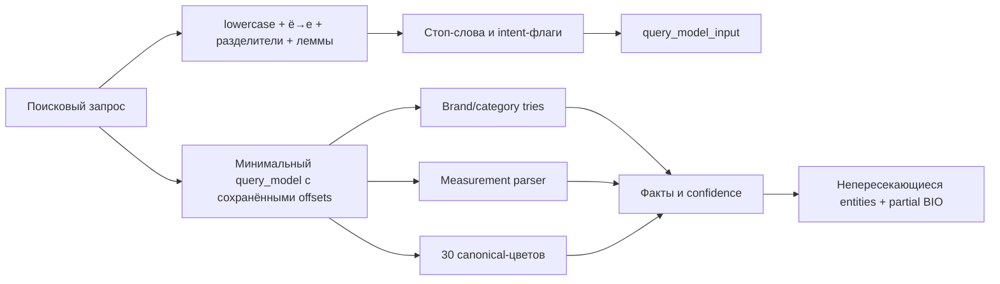

# Production-набор предобработки и BIO-разметки

Актуальность: **22 июля 2026 года**. Этот документ фиксирует минимальный рабочий набор, который необходимо хранить в GitHub и передавать команде для online-инференса. Машиночитаемая версия списка находится в [`production_manifest.json`](production_manifest.json).

## Что запускается в production

Единственная публичная точка входа:

```python
from unified_query_annotator import annotate_query

result = annotate_query("айфон самсунг темно синий 256 гб")
```

При запуске один раз загружаются trie-словари, палитра и морфологический анализатор. Объект annotator кэшируется внутри процесса. Для каждого следующего запроса выполняются нормализация, стоп-слова, dictionary matching, measurement/color parsing, разрешение пересечений и построение partial BIO.



## Обязательные боевые файлы

| Файл | Назначение | Нужен online |
|---|---|---:|
| `unified_query_annotator.py` | API `annotate_query`, CLI, сбор и согласование всех фактов | да |
| `requirements-runtime.txt` | минимальные зависимости без ML/ETL-библиотек | да |
| `text_preprocessing/__init__.py` | пакет Python | да |
| `text_preprocessing/preprocess_queries.py` | NFKC, `ё→е`, lowercase, разделители, пробелы, безопасные леммы | да |
| `text_preprocessing/stopwords.ru.json` | стоп-слова, защищённые токены и слова намерения | да |
| `search_dictionaries/__init__.py` | пакет Python | да |
| `search_dictionaries/color_normalizer.py` | longest-match цветов, spans и BIO | да |
| `search_dictionaries/color_palette.py` | стабильные 30 canonical-классов цвета | да |
| `search_dictionaries/measurement_parser.py` | число + единица, тип характеристики, spans и BIO | да |
| `search_dictionaries/units.py` | RU/EN единицы и размерности | да |
| `search_dictionaries/output/brands.json` | 6 475 canonical-брендов и aliases | да |
| `search_dictionaries/output/categories.json` | 6 963 каталоговые категории и поисковые поверхности | да |
| `search_dictionaries/output/category_alias_overrides.json` | приоритетные синонимы/product families → общий класс | да |
| `search_dictionaries/output/color_aliases.csv` | активные поверхности цветов → палитра 30 | да |

Суммарный размер проверяется командой `verify_production_runtime.py`. Исходные `query_clicks.parquet`, `sku_desc.parquet`, `skus.pkl`, silver dataset и RuBERT-модели online-коду не нужны.

## Файлы контроля качества, которые также храним в GitHub

| Файл | Для чего |
|---|---|
| `production_manifest.json` | машиночитаемый контракт production-комплекта |
| `verify_production_runtime.py` | проверка комплектности, spans, BIO, smoke cases и скорости |
| `test_unified_query_annotator.py` | end-to-end unit-тесты |
| `search_dictionaries/output/dictionary_metrics.json` | размеры и статистика сборки словарей |
| `search_dictionaries/output/alias_coverage_metrics.json` | покрытие aliases на реальных запросах и click-evidence |
| `search_dictionaries/output/color_metrics.json` | версия и покрытие цветовой палитры |
| `search_dictionaries/output/normalization_contract.json` | порядок и версия общей нормализации |
| `.github/workflows/production-check.yml` | автоматическая проверка production-пакета и unit-тестов после push/PR |

## Исходники для обновления словарей

Эти файлы не читаются online, но должны храниться в репозитории для review и воспроизводимого развития:

| Файл | Назначение |
|---|---|
| `pavel_nntp/data/dictionaries/brand_aliases.json` | проверенные кириллические и разговорные варианты брендов |
| `pavel_nntp/data/dictionaries/category_aliases.json` | RU/EN синонимы общих категорий |
| `pavel_nntp/data/dictionaries/product_family_aliases.json` | `айфон → iphone`, `макбук → macbook` и другие семейства |
| `pavel_nntp/data/dictionaries/product_family_to_brand.json` | связь семейства с брендом для offline-признаков |
| `pavel_nntp/data/dictionaries/brands.json` | canonical-бренды каталога |
| `pavel_nntp/data/dictionaries/categories.json` | canonical-дерево категорий каталога |
| `search_dictionaries/build_dictionaries.py` | сборка brands/categories/units и compiled lookup |
| `search_dictionaries/build_color_dictionary.py` | сборка палитры и color aliases |
| `search_dictionaries/audit_alias_coverage.py` | проверка aliases на полном корпусе запросов |
| `search_dictionaries/verify_dictionaries.py` | структурная проверка результатов сборки |

Полная пересборка требует приватного каталожного snapshot в `pavel_nntp/data/processed`. Он не входит в production-пакет. В GitHub сохраняются готовые компактные runtime-артефакты, поэтому приложение запускается без исходных parquet/pickle.

## Установка и запуск

Минимальное online-окружение:

```powershell
py -3.12 -m venv .venv
.\.venv\Scripts\python.exe -m pip install --upgrade pip
.\.venv\Scripts\python.exe -m pip install -r requirements-runtime.txt
.\.venv\Scripts\python.exe verify_production_runtime.py
```

Ручной ввод:

```powershell
.\.venv\Scripts\python.exe unified_query_annotator.py
```

Один JSON-ответ:

```powershell
.\.venv\Scripts\python.exe unified_query_annotator.py --json `
  "телефон самсунг черный 256 гб"
```

Полное окружение для пересборки, аудитов и RuBERT:

```powershell
.\.venv\Scripts\python.exe -m pip install -r requirements.txt
```

## Контракт результата

- `texts.query_model` — текст, относительно которого валидны `start/end` и BIO.
- `texts.query_model_input` — очищенное представление для downstream-модели.
- `facts` — все принятые факты с canonical value, confidence и источником.
- `entities` — непересекающийся набор фактов, выбранный для BIO.
- `bio_tags` — `B-type/I-type/O`.
- `bio_supervision_mask` — `true` только для положительно подтверждённых токенов.
- `rejected_candidates` — найденные, но отклонённые кандидаты с причиной.

Автоматический `O` не является gold-отрицательным классом: это positive-only partial BIO. Для полноценного обучения и финальной оценки необходима ручная gold-разметка.

## Обновление aliases

1. Добавить reviewed-вариант в `brand_aliases.json` или `category_aliases.json`.
2. Не добавлять fuzzy-исправление автоматически: сначала проверить click-evidence.
3. Запустить полную offline-сборку словарей.
4. Запустить `audit_alias_coverage.py`, `verify_dictionaries.py` и unit-тесты.
5. Проверить `verify_production_runtime.py`.
6. Закоммитить исходный alias-файл вместе с изменёнными compiled-артефактами и метриками.

Пример уже применённого precision-контроля: `ноут` исключён, поскольку в реальных данных часто означает Redmi Note. `iphone/айфон` при этом детерминированно приводятся к `Смартфоны`, а более длинное `чехол для телефона` остаётся категорией `Чехлы для телефонов`.

## Что не загружать обычным Git

Корневые `query_clicks.parquet`, `sku_desc.parquet` и `skus.pkl` занимают около 2,5 ГБ и исключены через `.gitignore`. Также не загружаются `.venv`, кэши, временные DuckDB/JSONL и тяжёлые generated CSV/parquet из `search_dictionaries/output`.

Если команде действительно нужны исходные данные, используйте согласованное приватное хранилище или Git LFS, предварительно проверив лицензию и наличие персональных/коммерческих данных.

## GitHub checklist

```powershell
# Проверить, что raw-файлы игнорируются
git check-ignore -v query_clicks.parquet sku_desc.parquet skus.pkl

# Проверить production-комплект
.\.venv\Scripts\python.exe verify_production_runtime.py

# Посмотреть всё, что войдёт в commit
git status --short
git diff --check
```

Перед `git commit` отдельно проверьте уже staged-файлы: Git включает в commit не только последний `git add`, а весь текущий index.

Чтобы добавить именно production-код, его исходные словари и документацию, не используйте слепой `git add .`. Безопаснее указать подготовленные области явно:

```powershell
git add -- `
  .gitignore `
  .github/workflows/production-check.yml `
  README.md PRODUCTION_DEPLOYMENT.md PIPELINE_HANDOFF.md FILE_SUMMARIES.md FILE_SUMMARIES_RU.md `
  production_manifest.json requirements.txt requirements-runtime.txt `
  unified_query_annotator.py verify_production_runtime.py test_unified_query_annotator.py `
  search_dictionaries `
  text_preprocessing `
  pavel_nntp/process_query_clicks.py `
  pavel_nntp/data/dictionaries

git diff --cached --name-only
git diff --cached --stat
```

В текущем репозитории могли остаться staged-файлы от silver-разметки или прошлых задач. Их нужно либо осознанно оставить в этом commit, либо предварительно вынести в отдельный commit.

После push GitHub Actions `production-check` повторяет установку только runtime-зависимостей, проверку manifest/smoke cases и 33 runtime-теста на чистом Ubuntu + Python 3.12.
